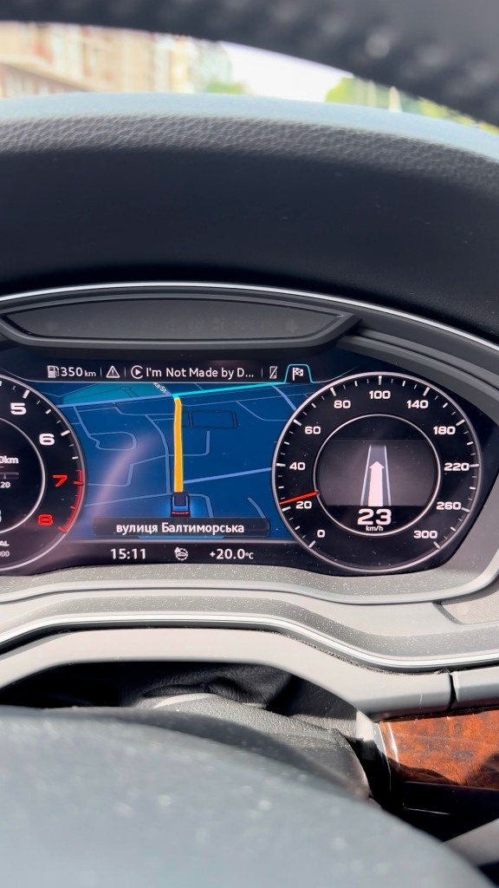
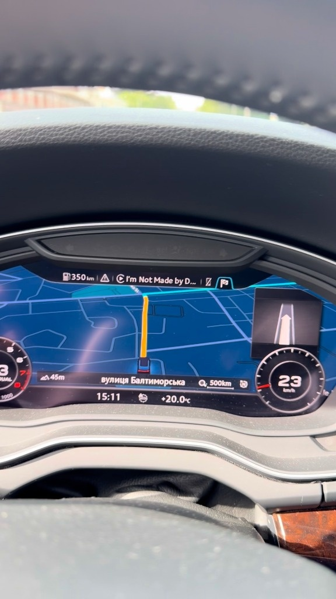
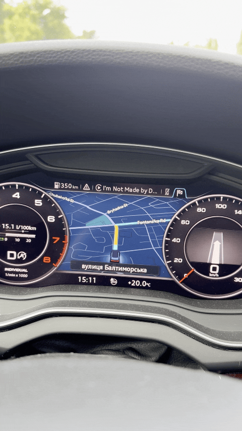

# MIB2 Toolbox — CarPlay AltScreen + Інтеграція підказок навігації (RGI)

[English](README.md) | **Українська**

Цей каталог містить пакет для SD-карти під мультимедійні системи Audi **MHI2Q**, який вмикає трансляцію **нативного відеопотоку CarPlay AltScreen (другий екран з навігаційною мапою)** безпосередньо на панель приладів **Virtual Cockpit**. Відеопотік повністю інтегровано з 3D-стрілками маневрів turn-by-turn, керуванням зумом карти з керма та налаштуванням центрування мітки авто.

Основний графічний конвеєр, видалення сторонніх водяних знаків, виправлення геометрії 1:1, керування масштабом з керма та інтеграція RGI успішно перевірені на реальному автомобілі.

**Підтверджено та протестовано на:**
- **Автомобіль:** Audi Q5 (FY) 2019
- **Версія прошивки (Train):** `MHI2Q_ER_AUG22_P5092`
- **Версія MU Software:** `1329`
*(Також сумісно з іншими блоками MHI2Q версій AUG22, що підтримуються перевірками інсталятора).*

> [!IMPORTANT]
> Цей пакет змінює конфігураційні файли та системні бінарники головного пристрою. Тримайте SD-карту вставленою та забезпечте стабільне живлення акумулятора автомобіля під час встановлення, запуску або відновлення.  
> **Після встановлення чи відновлення обов'язково виконайте повне перезавантаження головного пристрою (комбінацією клавіш MMI), як описано в інструкції.**  
> Не виконуйте процедуру встановлення чи налаштування під час руху.

---

## 🖼️ Демонстрація роботи в авто

<p align="center">
  
  <br />
  <sub>Відеопотік мапи CarPlay із накладанням маневрів на панелі Audi Virtual Cockpit (режими Classic та Sport)</sub>
</p>

<p align="center">
  <br />
  <sub>Зум мапи на панелі Virtual Cockpit за допомогою коліщатка на кермі</sub>
</p>

---

## ✨ Можливості та вдосконалення

Цей пакет об'єднує оригінальні проекти **[MHI2Q-CarPlay-AltScreen](https://github.com/yuedizhibo/MHI2Q-CarPlay-AltScreen)** та **[mib2q-carplay-rgi](https://github.com/luka-dev/mib2q-carplay-rgi)** разом із локальними поліпшеннями:

- **CarPlay AltScreen у Virtual Cockpit:** Трансляція нативного другого екрана CarPlay (Apple Maps, Google Maps) через displayable 3 (контекст `Context 81`).
- **Зум карти з коліщатка керма:** Обертання лівого коліщатка керма надсилає в iOS штатну AirPlay-команду `changeMapZoomLevel` (`CRSUIClusterZoomAction`), керуючи масштабом карти CarPlay на приладці (від себе — віддалення, до себе — наближення). Штатна мапа під відео продовжує зумитися синхронно.
- **Вибір схеми розміщення мапи (центрування мітки авто):** У меню GEM доступні 4 варіанти розміщення (`AltScreen default`, `maneuver card on top`, `maneuver card on the right`, `no ETA`), що дозволяє збалансувати вигляд карти та розташувати курсор авто по центру.
- **Інтеграція підказок навігації (RGI):** 3D-стрілки поворотів, смуги руху, дистанція до маневру, час прибуття, назви доріг та проекція на лобове скло (HUD) безшовно накладаються поверх відеопотоку CarPlay у Display Context 81 (`{98, 101, 102, 3}`).
- **Автоматичний перехід на штатну мапу (Fallback):** Якщо відеопотік AltScreen не активний або у стані спокою, `ScreenModule` автоматично перемикається на Context 80 (3D-стрілки поверх штатної мапи Audi) або стан спокою Context 74.
- **Природні пропорції 1:1:** Фоновий сервіс дзеркалювання перезібрано зі співвідношенням сторін 1:1 та акуратним кадруванням знизу (clean bottom crop), завдяки чому мапа та елементи інтерфейсу не сплющуються і не розтягуються.
- **Оригінальний вигляд OEM (без водяних знаків):** Повністю видалено сторонні рекламні водяні знаки (`watermark.rgba` прозорий). На екрані запуску відображається фірмовий логотип Audi (`logo.rgba`) замість стороннього логотипу.
- **Безпечне об'єднання завантажувачів:** Скрипт `rgi_companion.sh` реєструє `CARPLAY_PRELOAD_EXTRA` у `smartphone_integrator.json`, забезпечуючи безконфліктне спільне завантаження бібліотек AltScreen та `libcarplay_hook.so` у `dio_manager`.
- **Резервне копіювання та повернення до заводського стану:** Заводські конфігураційні файли зберігаються в каталозі `MMI-Cockpit-Carplay/backup/`. Опція `RESTORE ORIGINAL` повністю відновлює початковий стан системи.

---

## 🚀 Встановлення та тестування

### 1. Збірка та підготовка SD-карти

За допомогою скрипту збірки з кореня репозиторію (збирає всі нативні модулі, Java-патч, розраховує контрольні суми JAR та копіює файли):

```sh
# Збірка та розміщення файлів у build/sd/
STOCK_JAR=MU1329-base.jar ./scripts/build_sd.sh

# Або прямий запис із верифікацією на FAT32 SD-карту:
SD=/Volumes/SD32 STOCK_JAR=MU1329-base.jar ./scripts/build_sd.sh
```

У корені SD-карти мають знаходитися:
`metainfo2.txt`, папка `Toolbox/`, `SD_CARD_README.txt` та `SHA256SUMS-SD.txt`.

> [!NOTE]
> Якщо на вашій карті вже є папка `MMI-Cockpit-Carplay/` із бекапами вашого авто, **обов'язково збережіть її на карті**. Пункт `RESTORE ORIGINAL` потребує саме цих оригінальних бекапів.

### 2. Оновлення або встановлення MIB Toolbox

1. Вставте SD-карту у слот 1 (SD1) магнітоли MMI.
2. Якщо MIB Toolbox уже встановлено: відкрийте зелене інженерне меню (GEM) -> **Toolbox -> Update Toolbox** для оновлення скриптів та меню.
3. Якщо MIB Toolbox ще не встановлено: запустіть стандартне меню **Оновлення ПЗ (SWDL)** у налаштуваннях авто та встановіть пакет за допомогою `metainfo2.txt`.
4. Переконайтеся, що в інженерному меню з'явився пункт `MMI-Cockpit-Carplay`.

### 3. Встановлення та запуск

У меню GEM **MMI-Cockpit-Carplay** послідовно виконайте такі кроки:

1. **Відключіть iPhone / CarPlay**, щоб під час інсталяції не транслювався відеопотік.
2. Виберіть пункт **INSTALL**. Дочекайтеся завершення (`INSTALL=PASS`, `reboot_required=YES`), після чого **повністю перезавантажте MMI** (утримуючи шайбу MMI + верхню праву кнопку + перемикач навігації вгору).
3. Після завантаження увійдіть у GEM -> **MMI-Cockpit-Carplay -> START**. Дочекайтеся `START=PASS` та `reboot_required=YES`, після чого **знову повністю перезавантажте MMI**.
4. Після другого перезавантаження підключіть iPhone, запустіть CarPlay та увімкніть навігацію (Apple Maps / Google Maps). На приладовій панелі Virtual Cockpit з'явиться повноцінна мапа з накладанням навігаційних стрілок.

### 4. Перевірка роботи та налаштування

- **Зум з керма:** Під час ведення по маршруту покрутіть ліве коліщатко на кермі для зміни масштабу мапи CarPlay.
- **Схема розміщення мапи (положення мітки):** У GEM -> **MMI-Cockpit-Carplay -> Cluster map layout** протестуйте 4 доступні пресети (перепідключаючи телефон після вибору кожного), щоб обрати варіант, за якого мітка машини розташована найзручніше у вашому режимі приладки (Classic чи Sport).
- **STATUS:** Відкрийте **MMI-Cockpit-Carplay -> STATUS** у GEM для діагностики: перевіряються змінні `DIO_PRELOAD_ALTSCREEN`, `DIO_PRELOAD_RGI`, `RGI_*` та активний контекст дисплея (`81` = відео + маневри, `80` = маневри на штатній мапі, `74` = спокій).

### 5. Повернення до заводських налаштувань

1. Вставте SD-карту з вашою резервною копією `MMI-Cockpit-Carplay`.
2. У GEM виберіть **MMI-Cockpit-Carplay -> RESTORE ORIGINAL** (або `STORE LOGS + RESTORE`, якщо бажаєте спершу зберегти логи діагностики).
3. Дочекайтеся `RESTORE=PASS` та `reboot_required=YES`, після чого перезавантажте систему. Усі модифікації буде видалено, а оригінальні файли відновлено.

---

## 📜 Ліцензії та подяки

- **Оригінальний проект AltScreen:** Розроблено [yuedizhibo](https://github.com/yuedizhibo) та [Lanye-z](https://github.com/Lanye-z) ([MHI2Q-CarPlay-AltScreen](https://github.com/yuedizhibo/MHI2Q-CarPlay-AltScreen)). Ліцензія оригінальних матеріалів: [PolyForm Noncommercial 1.0.0](LICENSE). Лише для некомерційного використання.
- **Інтеграція підказок навігації (RGI):** Розроблено [luka-dev](https://github.com/luka-dev/mib2q-carplay-rgi).
- **MIB2 High Toolbox:** Інструменти та скрипти інженерного меню від [jilleb](https://github.com/jilleb/mib2-toolbox) за ліцензією [MIT License](LICENSE.TOOLBOX-MIT).
- **Компонент дзеркалювання відео:** Окрема ліцензія [LICENSE.MMI-MIRROR](Toolbox/carplay_alt_screen/mirror_display/release/LICENSE.MMI-MIRROR).
